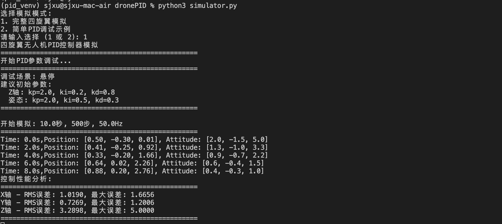
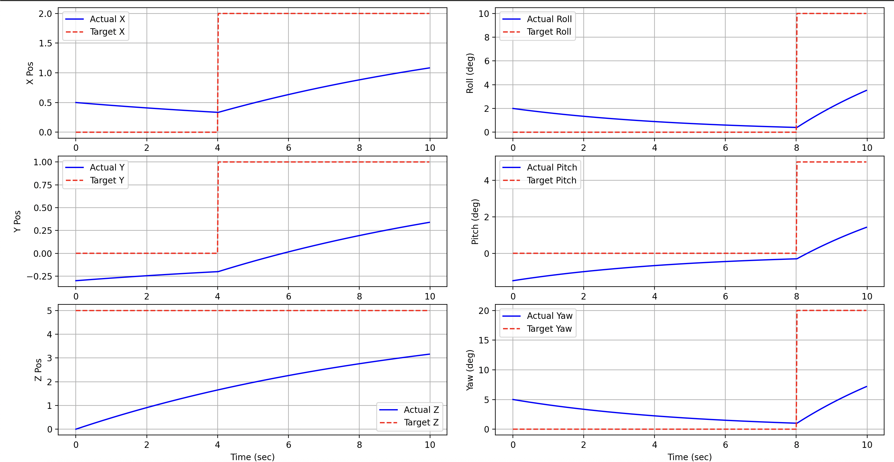
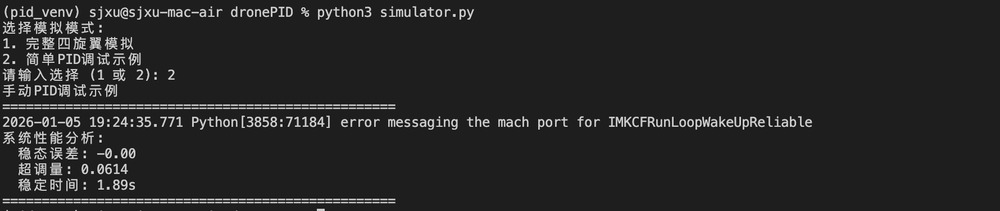
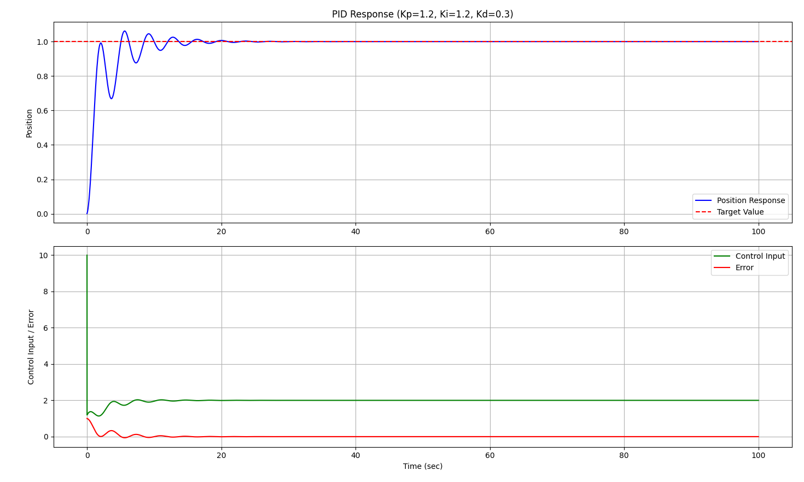

# 四旋翼机无人机 PID 仿真

## 项目描述

在学习 PID 流程中，构建简化条件下的一个 PID demo 仿真程序。

使用两层 PID 控制器，构建支持自动拟合位置和姿态的四旋翼飞控。

将输出结果转化为电机输出和姿态、位置变化。

## 功能特性

- 位置控制PID（X, Y, Z轴）
- 姿态控制PID（滚转、俯仰、偏航）
- 电机混控算法
- 实时调试和可视化
- 参数调优工具

## 安装和使用

1. 部署 python3 虚拟运行环境：`./run.sh`
2. 再次激活虚拟环境：`source dronePID/bin/activate`
3. PID仿真主程序：`python3 src/simulator.py`

## 项目结构

- `controller.py`: 定义了一个最原始的PID控制器类 `PIDController`。
- `quadcopter.py`: 使用 `PIDController` 来实现一个四轴飞行器的飞控类`QuadcopterPID`，根据位置（X, Y, Z轴）和姿态（滚转、俯仰、偏航），使用两层PID反馈循环来输出简化的电机动力。
- `simulator`: 使用定义的。
- `tuner.py`: 定义测试几种制定场景（悬停、阶跃响应、轨迹跟踪）下的quad控制器响应效果。
- `params.py`: 定义`PIDParams`数据类，用于定义PID模型基本参数。

## 使用样例

### A. 指定场景四旋翼飞控仿真

使用**模式1**模拟一个指定场景下，四悬翼电机输出曲线：

电机输出动力曲线绘图：

### B. 原始 PID 控制器仿真

通过**模式2**直接构建一个 PID 进行测试：

对应参数下 PID 拟合流程：

